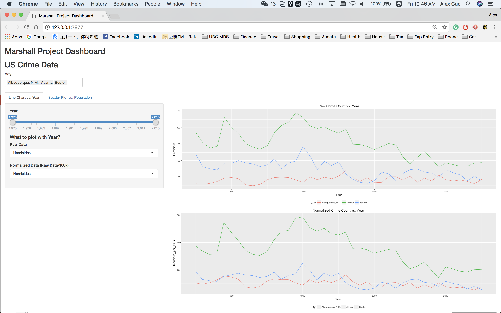
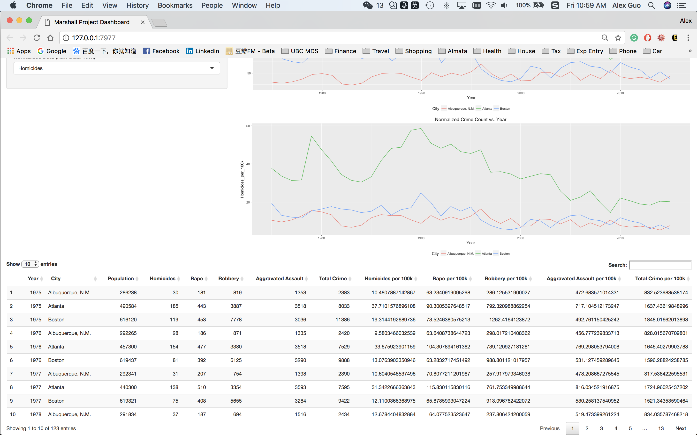

# Marshall Project Dashboard

DSCI 532 Milestone Project

Xin (Alex) Guo, Jan 2018

## Overview

Violent crimes have been an importatnt problem in the society. If we could understand what kind of city has high crime rate, it may be possible to reduce the crime from happening, also help the government to improve policies and regulations, and help people to choose where to live. To address this challenge, I built a data visualization app that allows people to visually explore a dataset of crime in US cities. My app will show crime information of selected cities, and allow users to explore different aspects of this data by filtering and re-ordering on different variables in order to compare factors that affects crime.

## Description of the Data

The dataset used in this app is the [Marshall Project Dataset](https://raw.github.ubc.ca/ubc-mds-2017/DSCI_532_milestone1_alexguox/master/data/marshall/ucr_crime_1975_2015.csv?token=AAADo0js1nmiV1hW_IMHR5OjXNSIzc2fks5ad6MNwA%3D%3D) collected and curated by [The Marshall Project](https://www.themarshallproject.org/). It contains approximately 2,830 crime data for 68 US cities from 1975-2015 covering four types of violent crimes (homicides, rape, robbery, and aggravated assault). Each record has 13 associated variables that describe the year, the city name (department_name), the population of the city (total_pop), the absolute values of the four violent crimes and their sum (homs_sum, rape_sum, rob_sum, agg_ass_sum and violent_crime), and the crime rate normalized by the population (violent_per_100k, homs_per_100k, rape_per_100k, rob_per_100k, agg_ass_per_100k).

## Functions of the App

You can find the deloyed Shiny app at [Marshall Project Dashboard](https://alexguoxin.shinyapps.io/Marshall-Project-Dashboard/).

Just select the cities, year range, population range and the type of crime to be plotted with year and population.

- Select cities to be plotted
- In the "Line Chart vs. Year" tab:
	- Select year range
	- Select the type of crime to be plotted with year in raw data
	- Select the type of crime to be plotted with year in normalized data
- In the "Scatter Plot vs. Population" tab:
	- Select population range
	- Select the type of crime to be plotted with population in raw data
	- Select the type of crime to be plotted with population in normalized data 

Then the plots will show up on the right in different tabs and a filtered searchable table will be on the bottom.

